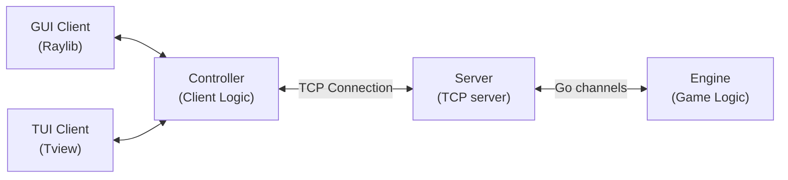

*This project has been created as part of the 42 curriculum by crappo, aluslu.*

# TAP - The Answer Protocol

A multiplayer retro text and graphical adventure game (MUD/RPG) built in **Go**. *The Answer Protocol (TAP)* features a high-performance concurrent TCP server, a decoupled thread-safe game engine, a customizable terminal interface (TUI), and an interactive 2D graphical visual client (GUI).

---

## Sub-Component Documentation

For in-depth documentation on individual modules, please consult the dedicated README files:
- [Server Documentation](./server/README.md)
- [Engine Documentation](./engine/README.md)
- [Client Controller Documentation](./client/controller/README.md)
- [TUI Client Documentation](./client/tui/README.md)
- [GUI Client Documentation](./client/gui/README.md)

---

## Description

**The Answer Protocol (TAP)** brings retro text-adventure mechanics into a modern multiplayer architecture. Players connect to a persistent server hosting a shared fantasy world where they can:
- Explore interconnected rooms and regions.
- Interact and converse with non-player characters (NPCs).
- Accept, track, and complete multi-stage quests.
- Manage inventories, trade, and use items.
- Form adventuring parties with other real-time players.
- Engage in initiative-driven, turn-based combat against hostile creatures.

The project is designed with strict separation of concerns, decoupling connection handling from game state mutation and presentation layers.

---

## Architecture

### Server Design & Dispatcher Model
The server architecture decouples network connection handling from game state processing using Go's concurrent channels:
- **Network Gateway (Server)**: Listens for incoming TCP connections on a dedicated listener goroutine. Each connected client gets lightweight reader and writer goroutines to manage non-blocking socket stream I/O.
- **Thread-Safe Exchanger (`pr.Exchanger`)**: Acts as a thread-safe message bridge between the network layer and game engine, exposing `ServerInput`, `ServerOutput`, `JoinChan`, and `LeaveChan` channels.
- **Single-Threaded Engine Loop**: The game `Engine` runs a single-threaded event loop (`broadcaster`). By processing requests sequentially from `ServerInput`, state updates (combat turns, room movement, inventory modifications) occur without needing global mutex locks.

### Client Architecture
Clients use a decoupled Controller pattern (`client/controller`):
- **Controller**: Maintains client-side state caches, parses incoming server responses/events (`EVT`), and serializes outgoing protocol commands.
- **Presenters (TUI & GUI)**: Interchangeable frontends (`tview`/`tcell` for TUI, `raylib` for GUI) bind to controller events to render terminal panels or 2D tilemaps.

### System Architecture Diagram



---

## Protocol Implementation

TAP implements and extends the **RFC 42TAP** specification:

### Extensions & Deviations
1. **Graphical Position Synchronization**:
   - Added `NOTIFY_PLAYER_POSITION`, `GET_PLAYER_POSITIONS`, `NOTIFY_ITEM_POSITION`, and `GET_ITEM_POSITIONS` commands.
   - Bypassed by the server rate limiter to allow smooth real-time 2D sprite interpolation on GUI clients.
2. **Structured JSON Data Envelopes**:
   - Protocol responses embed structured JSON objects in a `datas` field (e.g., room details, combat state snapshots, quest lists) along with standard RFC line headers (`OK`, `ERR`, `EVT`).
3. **Multi-Party Group Management**:
   - Implemented extended group sub-commands (`GROUP CREATE`, `INVITE`, `KICK`, `JOIN`, `LEAVE`, `PROMOTE`, `ACCEPT`, `DECLINE`).
4. **Rich Combat Event Notifications**:
   - Emits structured asynchronous events (`EVT COMBAT FIGHT_STARTED`, `EVT COMBAT ALLY_TURN`, `EVT COMBAT VICTORY`, `EVT COMBAT DEFEAT`).

---

## Combat System

### Turn Mechanics & Initiative
- Combat is initiated when a player attacks a hostile NPC using `ATTACK [target]`.
- All team members in the same room automatically join the active `CombatSession`.
- **Initiative Order**: Turn order is calculated by sorting fighters in descending order of their `Initiative` attribute (`sortTurnsOrderByInitiative`).

### Combat Actions
- `ATTACK [target]`: Deals damage equal to attacker's base damage stat to target NPC or fighter.
- `FLEE`: Attempts to escape the active combat. If all players flee, the combat session is cancelled.
- `COMBAT STATS`: Queries live turn order, team HP, opponent HP, and active turn holder.

### Damage Formula & Turn Limits
- **Damage Formula**: `Net Damage = Attacker Damage - Target Shield`.
- **Turn Timeout**: Players have 100 seconds (`MaxTurnSeconds`) per turn. If a turn times out, a system signal advances the turn to prevent stalling.
- **Victory & Defeat**:
  - **Victory**: Grants NPC rewards, records defeated enemies, and updates quest objectives.
  - **Defeat**: Players respawn at the Entrance (`Overgrown Path`) with 50% max HP.

---

## Quest System

### Mechanics & Validation
- Quests are defined in `world.json` with clear descriptions, progress metrics, targets, and rewards.
- **States**: `not_started`, `in_progress`, `completed`.
- **Validation (`refreshQuestProgress`)**: Automatically checks player progress against requirements:
  - *Target Defeat*: Verifies if required target NPC ID exists in `player.DefeatedNpcs`.
  - *Target Item*: Verifies if required item ID exists in player inventory.
- **Rewards**: Automatically grants reward items (such as `gold_acorn`) to player inventory upon completing quest validation.

---

## World Design

The game world is configured via `world.json` and structured as an interconnected room graph:

```
TODO
```

### Key Areas & NPCs
- **Overgrown Path (Entrance)**: Starting area; home to `shepherd_hana`.
TODO

### Item Distribution
- **Tools**: `rusty_hoe`, `watering_can`.
TODO

---

## Server Logging

Server logs utilize Go's structured `log/slog` library:

### Log Format
```json
{
  "timestamp": "2026-09-27T16:00:00Z",
  "level": "INFO",
  "message": "COMMAND_EXECUTED",
  "datas": {
    "client_id": "8f3b7b32-8418-4bfa-9f89-c454e95155f9",
    "command": "MOVE north"
  }
}
```

### Events & Abuse Detection
- **Monitored Events**: Connection state (`CLIENT_CONNECTED`, `CLIENT_DISCONNECTED`), authentication, command executions, engine panics.
- **Abuse Prevention**: Token Bucket rate-limiting tracks rapid incoming commands per socket. Excessive command volume triggers `WARN_SPAM` (`ERR 902`) warnings and forces immediate socket disconnect for continuous flooders.

---

## Group Contributions

- **`crappo` (Clément Rappo)**:
  - Core Engine architecture and event loop implementation.
  - Turn-based combat engine, initiative order, damage formulas, and turn timeouts.
  - Quest validation system and world state handlers.
  - Terminal UI (TUI) layout, combat panels, and Client Controller state manager.
- **`aluslu` (Ali Uslu)**:
  - Server networking architecture, TCP listener, client session tracking, and socket I/O.
  - Token-bucket rate limiter and anti-flood protection.
  - RFC 42TAP protocol command parsing and error handling.
  - Network resilience and scenario integration test suites.

---

## Building and Running

### Prerequisites
- **Go**: Version 1.26 or higher.
- **C Compiler / X11 / OpenGL headers**: Required for Raylib GUI compilation on Linux (e.g., `libgl1-mesa-dev`, `xorg-dev`).

### Instructions

1. **Download Dependencies**:
   ```bash
   make deps
   ```

2. **Build All Binaries**:
   ```bash
   make build
   ```
   *Binaries are compiled to the `exec/` directory (`exec/server`, `exec/tui`, `exec/gui`).*

3. **Running the Server**:
   ```bash
   make server
   ```

4. **Running Clients**:
   - **TUI Client**:
     ```bash
     make tui
     ```
   - **GUI Client**:
     ```bash
     make gui
     ```

5. **Clean Build Artifacts**:
   ```bash
   make clean
   ```

---

## Testing

The codebase includes comprehensive integration, network, and scenario test suites:

### Running Tests
To run all tests:
```bash
make test
```
Or directly using `go test`:
```bash
go test ./tests/network/... ./tests/scenarios/... -count=1
```

### Test Suite Coverage
- **Network Resilience (`tests/network/`)**:
  - Connection acceptance & max connection limits (`max_player_limit_test.go`).
  - Rate limiting & anti-flood detection (`anti_flood_test.go`).
  - TCP payload fragmentation & coalescing (`tcp_fragment_coalescing_test.go`).
  - Zombie client timeouts & graceful server shutdowns.
- **Scenario Integration (`tests/scenarios/`)**:
  - Combat initiation, turn processing, and victory/defeat resolution (`attack_scenarios.go`).
  - Multi-user concurrency and movement race condition prevention (`concurrency_scenarios.go`).
  - Group creation, invitations, kicks, and leadership promotions (`group_scenarios.go`).
  - Item pick-up, dropping, using, and quest completion flows (`item_scenarios.go`).

---

## Resources

### References
- [Go Documentation](https://golang.org/doc/): Standard library reference for `net`, `sync`, `channels`, and `log/slog`.
- [Raylib Go Bindings](https://github.com/gen2brain/raylib-go): Documentation for 2D graphics rendering.
- [tview & tcell](https://github.com/rivo/tview): Terminal UI widget framework for Go.
- [RFC 42TAP Specification]: Standard guidelines for text-based multiplayer adventure protocols.

### AI Usage
During this project, AI was used in order to understand key concepts like:
- Channels/go routines
- Tview/Tcell usage
- Raylib helper, to understand the usage

It was also used to help us:
- Find an adaptated architecture for the project
- Make reviews about the code
- Write the documentation bases
